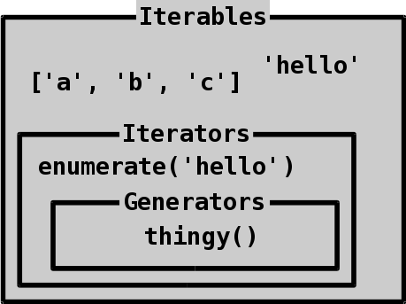
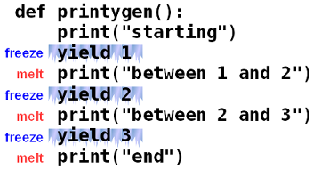

# Iterables, iterators and generators

So far we have used for loops with many different kinds of things.

```python
>>> for name in ['theelous3', 'RubyPinch', 'go|dfish']:
...     print(name)
...
theelous3
RubyPinch
go|dfish
>>> for letter in 'abc':
...     print(letter)
...
a
b
c
>>>
```

For looping over something is one way to **iterate** over it. Some other
things also iterate, for example, `' '.join(['a', 'b', 'c'])` iterates
over the list `['a', 'b', 'c']`. If we can iterate over something, then
that something is **iterable**. For example, strings and lists are
iterable, but integers and floats are not.

```python
>>> for thing in 123:
...     print(thing)
...
Traceback (most recent call last):
  File "<stdin>", line 1, in <module>
TypeError: 'int' object is not iterable
>>>
```

## Iterators

Lists and strings don't change when we iterate over them.

```python
>>> word = 'hi'
>>> for character in word:
...     print(character)
...
h
i
>>> word
'hi'
>>>
```

We can also iterate over [files](../basics/files.md), but they remember
their position and we get the content once only if we iterate over them
twice.

```python
>>> with open('test.txt', 'w') as f:
...     print("one", file=f)
...     print("two", file=f)
...
>>> a = []
>>> b = []
>>> with open('test.txt', 'r') as f:
...     for line in f:
...         a.append(line)
...     for line in f:
...         b.append(line)
...
>>> a
['one\n', 'two\n']
>>> b
[]
>>>
```

We have also used [enumerate](../basics/zip-and-enumerate.md)
before, and it actually remembers its position also:

```python
>>> e = enumerate('hello')
>>> for pair in e:
...     print(pair)
...
(0, 'h')
(1, 'e')
(2, 'l')
(3, 'l')
(4, 'o')
>>> for pair in e:
...     print(pair)
...
>>>
```

**Iterators are iterables that remember their position.** For example,
`open('test.txt', 'r')` and `enumerate('hello')` return iterators.
Iterators can only be used once, so we need to create a new iterator if
we want to do another for loop.

All iterators are iterables, but not all iterables are iterators. Like
this:


## Iterating manually

Iterators have a magic method called `__next__` that gets next value and
moves the iterator forward.

```python
>>> e = enumerate('abc')
>>> e.__next__()
(0, 'a')
>>> e.__next__()
(1, 'b')
>>> e.__next__()
(2, 'c')
>>>
```

There's also a built-in `next()` function that does the same thing:

```python
>>> e = enumerate('abc')
>>> next(e)
(0, 'a')
>>> next(e)
(1, 'b')
>>> next(e)
(2, 'c')
>>>
```

Here `e` remembers its position, and every time we call `next(e)` it
gives us the next element and moves forward. When it has no more values
to give us, calling `next(e)` raises a StopIteration:

```python
>>> next(e)
Traceback (most recent call last):
  File "<stdin>", line 1, in <module>
StopIteration
>>>
```

There is usually not a good way to check if the iterator is at the end,
and it's best to just try to get a value from it and
[catch](../basics/exceptions.md#catching-exceptions) StopIteration.

That's actually what for loops do. For example,
this code...

```python
for pair in enumerate('hello'):
    print(pair)
```

...does roughly the same thing as this code:

```python
e = enumerate('hello')
while True:
    try:
        pair = next(e)
    except StopIteration:
        # it's at the end, time to stop
        break
    # we got a pair
    print(pair)
```

The for loop version is much simpler to write and I wrote the while loop
version just to show how the for loop works.

## Converting to iterators

Now we know what iterating over an iterator does. But how about
iterating over a list or a string? They are not iterators, so we can't
call `next()` on them:

```python
>>> next('abc')
Traceback (most recent call last):
  File "<stdin>", line 1, in <module>
TypeError: 'str' object is not an iterator
>>>
```

There's a built-in function called `iter()` that converts anything
iterable to an iterator.

```python
>>> i = iter('abc')
>>> i
<str_iterator object at 0x7f987b860160>
>>> next(i)
'a'
>>> next(i)
'b'
>>> next(i)
'c'
>>> next(i)
Traceback (most recent call last):
  File "<stdin>", line 1, in <module>
StopIteration
>>>
```

Calling `iter()` on anything non-iterable gives us an error.

```python
>>> iter(123)
Traceback (most recent call last):
  File "<stdin>", line 1, in <module>
TypeError: 'int' object is not iterable
>>>
```

If we try to convert an iterator to an iterator using `iter()` we just
get back the same iterator.

```python
>>> e = enumerate('abc')
>>> iter(e) is e
True
>>>
```

So code like this...

```python
for thing in stuff:
    print(thing)
```

...works roughly like this:

```python
iterator = iter(stuff)
while True:
    try:
        thing = next(iterator)
    except StopIteration:
        break
    print(thing)
```

## Checking if object is iterable or not

There is an easy way of checking if an object in python is iterable or not. The following code will do the needful.
```python
>>> def check(A):
...     try:
...         st = iter(A)
...         print('yes')
...     except TypeError:
...         print('no')
...
>>> check(25)
no
>>> check([25,35])
yes
>>>
```
Here you can observe that the 25 is an integer, so it is not iterable, but [25,35] is a list which is iterable so it outputs no and yes respectively.

## Generators

It's possible to create a custom iterator with a class that defines an
`__iter__` method that returns self and a `__next__` method that gets
the next value. I'm not going to talk about it now because there's a
much simpler way to implement iterators. Let's make a function that
creates an iterator that behaves like `iter([1, 2, 3])` using the
`yield` keyword:

```python
>>> def thingy():
...     yield 1
...     yield 2
...     yield 3
...
>>>
```

We can only `yield` inside a function, yielding elsewhere raises an
error.

```python
>>> yield 'hi'
  File "<stdin>", line 1
SyntaxError: 'yield' outside function
>>>
```

Let's try out our thingy function and see how it works.

```python
>>> thingy()
<generator object thingy at 0xb723d9b4>
>>>
```

What the heck? We don't return anything from the function, but it still
doesn't return None!

Putting a `yield` anywhere in a function makes it return **generators**.
**Generators are iterators** with some more features that we don't need
to care about.



The generators that thingy gives us work just like other iterators:

```python
>>> t = thingy()
>>> t
<generator object thingy at 0xb72300f4>
>>> next(t)
1
>>> next(t)
2
>>> next(t)
3
>>> next(t)
Traceback (most recent call last):
  File "<stdin>", line 1, in <module>
StopIteration
>>> for number in thingy():
...     print(number)
...
1
2
3
>>>
```

This whole thing may feel kind of insane. If we add some parts between
the yields, when do they run? How does Python know when to run what?

Let's find out.

```python
>>> def printygen():
...     print("starting")
...     yield 1
...     print("between 1 and 2")
...     yield 2
...     print("between 2 and 3")
...     yield 3
...     print("end")
...
>>> p = printygen()
>>>
```

That's weird! We called it, but it didn't print "starting"!

Let's see what happens if we call `next()` on it.

```python
>>> got = next(p)
starting
>>> got
1
>>>
```

Now it started, but it's frozen! It's just stuck on that `yield 1`.

An easy way to think about this is to compare it to our computers.
When we suspend a computer it goes into some kind of stand-by mode,
and we can later continue using the computer all of our programs are
still there just like they were when we left.

A similar thing happens here. Our function is running, but it's just
stuck at the yield and waiting for us to call `next()` on it again.

```python
>>> next(p)
between 1 and 2
2
>>> next(p)
between 2 and 3
3
>>> next(p)
end
Traceback (most recent call last):
  File "<stdin>", line 1, in <module>
StopIteration
>>>
```

Here's a drawing of what's going on:



The good news is that **usually we don't need to worry about when
exactly the parts between the yields run**. Actually we don't even need
to use `iter()` and `next()` most of the time, but I think it's nice to
know how for loops work.

`yield` is useful when we want the function to output so many things
that making a list of them would be too slow or the list wouldn't fit in
the computer's memory. So instead of this...

```python
def get_things():
    result = []
    # code that appends things to result
    return result
```

...we can do this:

```python
def get_things():
    # code that yields stuff
```

Both of these functions can be used like this:

```python
for thing in get_things():
    # do something with thing
```

It's actually possible to create an iterator that yields an infinite
number of things:

```python
>>> def count():
...     current = 1
...     while True:
...         yield current
...         current += 1
...
>>> c = count()
>>> next(c)
1
>>> next(c)
2
>>> next(c)
3
>>> next(c)
4
>>>
```

[The itertools module](https://docs.python.org/3/library/itertools.html)
contains many useful things like this. For example, `itertools.count(1)`
does the same thing as our `count()`.

## Summary

- An iterable is something that we can for loop over.
- An iterator is an iterable that remembers its position.
- For loops create an iterator of the iterable and call its `__next__`
    method until it raises a StopIteration.
- Functions that contain yields return generators. Calling `next()` on a
  generator runs it to the next yield and gives us the value it yielded.
- [The itertools module](https://docs.python.org/3/library/itertools.html)
  contains many useful iterator-related things.
***

If you have trouble with this tutorial, please
[tell me about it](../contact-me.md) and I'll make this tutorial better,
or [ask for help online](../getting-help.md).
If you like this tutorial, please [give it a
star](../README.md#how-can-i-thank-you-for-writing-and-sharing-this-tutorial).

You may use this tutorial freely at your own risk. See
[LICENSE](../LICENSE).

[Previous](magicmethods.md) | [Next](../README.md) |
[List of contents](../README.md#advanced)
